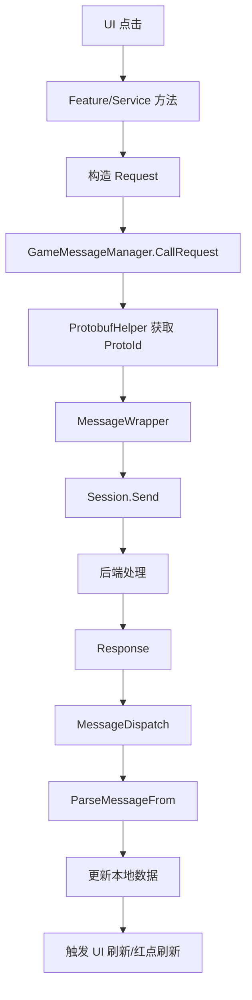

# LNV 前后端接口接入规范

## 1. 这篇笔记解决什么问题

这篇记录 LNV 项目前端接后端接口的完整规范，重点是区分两类接口：

- 平台服 HTTP 接口：登录前、渠道、区服、公告、包校验等。
- 游戏服 Protobuf 长连接接口：登录后业务接口、活动、战斗、玩家数据等。

核心代码位置：

```text
D:\LNV\trunk\client\Hotfix\Core\WebService\Manager.cs
D:\LNV\trunk\client\Hotfix\Managers\Network\NetMessageManager.cs
D:\LNV\trunk\client\Hotfix\Utils\ProtobufHelper.cs
D:\LNV\trunk\client\Hotfix\PBStruct
D:\LNV\trunk\client\Hotfix\Core\LifeCycle\LifeCycleState\LifeCycleLogin.cs
D:\LNV\trunk\client\Hotfix\Features\Login.cs
D:\LNV\trunk\client\Hotfix\Core\Feature.cs
D:\LNV\trunk\client\Hotfix\Features\Manager.cs
```

## 2. 接口总体分类

LNV 客户端接口主要分两条链路：

```text
平台服 HTTP 链路
用于登录前或平台相关数据。

游戏服 Protobuf 长连接链路
用于登录后的游戏业务数据。
```

简单判断：

```text
区服、公告、渠道、包校验、token 校验
通常走 WebService HTTP。

角色、活动、奖励、战斗、背包、资源、任务
通常走 GameMessageManager Protobuf。
```

## 3. 平台服 HTTP 链路

平台服入口：

```text
D:\LNV\trunk\client\Hotfix\Core\WebService\Manager.cs
```

核心对象：

```csharp
GameManager.WebServerManager
```

常见接口常量：

```text
Platform/getUserServer?
获取用户推荐/默认服务器

Platform/serverAll?
获取大区列表

Platform/serverPage?
获取大区服务器列表

Platform/login?
玩家登录服务器

Platform/serverRole?
玩家历史角色服务器

Platform/notice?
公告

Platform/getOpenId?
验证 login token

Platform/getChannelConfig?
获取渠道配置

Platform/checkPackageLogin?
验证包是否合法
```

## 4. QueryAll 平台服接口链路

登录时最关键的平台服接口是：

```csharp
GameManager.WebServerManager.QueryAll()
```

调用位置：

```text
D:\LNV\trunk\client\Hotfix\Core\LifeCycle\LifeCycleState\LifeCycleLogin.cs
```

链路：

```text
LifeCycleLogin.StartLogin()
-> VerifyPackage()
-> PlatformManager.Login()
-> VerifyToken()
-> WebServerManager.QueryAll()
-> 返回 ServerInfo
-> UI 登录界面选择服务器
-> Login.DoLogin(serverInfo)
```

`QueryAll()` 里会组装请求体：

```text
open_id
c_id
c_son_id
channel
device_type
uuid
package_version
is_test
access_token
country
language
is_filterate_old
```

接口返回后会保存：

```text
Uid
Sign
TimeStamp
IsWhite
selected server info
continent
```

这些数据后面登录游戏服要用。

特别是：

```text
Uid
Sign
TimeStamp
```

会在 `LoginRequest` 里带给游戏服。

## 5. 游戏服 Protobuf 链路

游戏服入口：

```text
D:\LNV\trunk\client\Hotfix\Managers\Network\NetMessageManager.cs
```

核心对象：

```csharp
GameManager.GameMessageManager
```

常用调用方式：

```csharp
var response = await GameManager.GameMessageManager.CallRequest<MyResponse>(
    new MyRequest
    {
        Id = id,
    });
```

底层链路：

```text
CallRequest<TResponse>(request)
-> ProtobufHelper.GetProtoId<TResponse>()
-> SessionCall(protoId, request)
-> MessageWrapper
-> Session.Send()
-> MessageDispatch()
-> 根据 SerialNumber 或 ProtoId 找回调
-> ParseMessageFrom<TResponse>()
-> 返回 response
```

## 6. Protobuf 协议注册

启动时会执行：

```csharp
Utils.ProtobufHelper.AutoRegisterProtocol();
```

位置：

```text
D:\LNV\trunk\client\Hotfix\Core\GameManager.cs
```

它会扫描带有：

```csharp
PBStruct.MessageAttribute
```

的 Protobuf 类型，并建立：

```text
Type -> ProtoId
```

映射。

如果接口调用时日志出现：

```text
GetProtoId error for type xxx
```

通常说明：

```text
协议没有生成
MessageAttribute 没有
Opcode 没注册
请求/响应类型用错
```

## 7. 游戏服登录接口链路

游戏服登录不直接在 UI 里做，而是在：

```text
D:\LNV\trunk\client\Hotfix\Features\Login.cs
```

核心方法：

```csharp
public async Task<ELoginType> DoLogin(Core.WebService.ServerInfo server)
```

链路：

```text
LifeCycleLogin.LoginGame(serverInfo)
-> Features.Login.DoLogin(serverInfo)
-> GameMessageManager.SetServerAddress(server.s_u, server.s_p, server.ws_url)
-> GameMessageManager.Connect(OnGameSessionError)
-> ServerTime.Sync(true, true)
-> RequestLogin(server)
-> CallRequest<LoginResponse>(new LoginRequest {...}, false)
-> 根据 LoginResponse.Status 判断登录结果
```

`LoginRequest` 里会带：

```text
Uid
ServerId
DeviceId
ClientType
ClientVersion
Platform
LoginTime
Sign
```

这里的 `Uid/Sign/LoginTime` 来自前面的 HTTP 平台服 `QueryAll()`。

所以登录链路是前后串起来的：

```text
平台服 QueryAll
-> 拿 uid/sign/time/server
-> 游戏服 LoginRequest
```

## 8. 新业务接口接入标准步骤

如果要接一个新的游戏服业务接口，按这个流程：

```text
1. 和后端确认协议名
2. 确认 Request 字段
3. 确认 Response 字段
4. 确认 ProtoId/Opcode
5. 更新并生成 PBStruct
6. 确认 ProtobufHelper 能注册协议
7. 在对应 Feature 或 Service 写 CallRequest
8. response 判空
9. 把 response 数据更新到 Feature/Module
10. 通知 UI 刷新
11. 真机或编辑器验证
```

代码模板：

```csharp
public async Task<bool> RequestSomething(int id)
{
    var response = await GameManager.GameMessageManager.CallRequest<SomethingResponse>(
        new SomethingRequest
        {
            Id = id,
        });

    if (response == null)
    {
        LOG.Game.E("SomethingResponse is null, id: {0}", id);
        return false;
    }

    // 更新本地数据
    SomethingValue = response.Value;

    // 通知 UI 或触发事件
    GameManager.GEventManager.Fire(EEvent.E_RESOURCE_UPDATE);
    return true;
}
```

## 9. 新 HTTP 接口接入标准步骤

如果要接平台服 HTTP 接口，建议放到：

```text
D:\LNV\trunk\client\Hotfix\Core\WebService
```

标准流程：

```text
1. 定义 Request 数据结构
2. 定义 Response 数据结构
3. 在 WebService.Manager 里添加 URI 常量
4. 组装 body
5. 调用 WebRequest(url, body)
6. JsonHelper.ToObject<T>() 解析
7. 处理 code
8. 返回业务需要的数据
```

伪代码：

```csharp
private const string QUERY_SOMETHING = "Platform/something?";

public async Task<SomethingData> QuerySomething()
{
    var url = $"{AotParam.ins.platform_url}{QUERY_SOMETHING}";
    var body = StringHelper.PackageBodyParams(new SomethingRequest
    {
        uid = Uid,
    });

    var resultJson = await WebRequest(url, body);
    if (string.IsNullOrEmpty(resultJson)) return null;

    var response = JsonHelper.ToObject<SomethingResponse>(resultJson);
    if (response == null || response.code != 200) return null;

    return response.data;
}
```

## 10. UI 不应该直接承担接口逻辑

建议的数据方向：

```text
UI
-> 调 Feature/Service 方法
-> Feature/Service 请求接口
-> 更新本地数据
-> UI 刷新显示
```

不要把大量接口解析、状态判断、红点刷新都写在 UI Controller 里。

原因：

```text
UI 容易频繁打开关闭
UI 生命周期不适合存核心数据
接口结果要被多个 UI 复用
登录后初始化数据通常不依赖某个 UI 是否打开
```

推荐结构：

```text
Feature/Service
负责接口请求和数据保存。

Module/Data
负责整理成 UI 需要的数据结构。

UI Controller
负责绑定按钮、调用方法、刷新视图。
```

## 11. 后端主动推送协议

如果是服务端主动推消息，不是客户端主动请求，要用：

```csharp
RegisterProtocol<TMessage>(OnMessage);
```

在 Feature 或 Service 里注册。

底层：

```text
Feature.RegisterProtocol<T>()
-> NetMessageManager.Register(action)
```

退出或回登录时，`Feature.Recycle()` 会自动注销。

示例：

```csharp
public override void Init()
{
    RegisterProtocol<TipsMessage>(OnTipMessage);
}
```

不要重复注册同一个协议，否则 `_messageHandlerMap.Add(protoId, ...)` 可能冲突。

## 12. 接口返回为空怎么查

`CallRequest` 返回 `null` 时，按这个顺序查：

```text
1. Session 是否已经连接
2. Request 是否真的 Send 出去了
3. Response 类型是否写对
4. ProtoId 是否注册
5. 后端是否返回 TipMessage
6. 是否超时
7. 是否网络断开
8. 是否请求字段缺失导致后端拒绝
9. 是否同一个 actionId 重复请求覆盖了回调
```

`NetMessageManager` 里有一个特殊逻辑：

```text
如果服务端业务逻辑出错，可能按原流水号返回 TipsMessage。
这时 CallRequest 会处理 TipMessage 并返回 default。
```

所以 response 为 null 不一定是网络问题，也可能是后端返回了业务错误。

## 13. 接口接入验证清单

每接一个接口，至少验证这些点：

```text
协议能编译
ProtoId 能注册
请求能发出
服务端能收到
Response 能回来
response 不为空
字段值符合预期
本地数据有更新
UI 有刷新
异常路径不会卡住
断线/超时有处理
```

如果是奖励接口，还要验证：

```text
重复领取
不可领取时点击
领取成功资源变化
红点消失
服务端数据重新拉取后状态一致
```

## 14. 前后端联调重点

联调时要和后端对清楚：

```text
Request 字段名
Request 字段类型
字段是否必填
Response 字段名
Response 字段类型
状态码含义
错误时返回 TipsMessage 还是 Response code
是否 RPC
是否登录后才能请求
是否依赖服务器时间
是否依赖活动开启状态
```

最容易出错的是：

```text
前端用 Response 类型取 ProtoId，而后端按 Request 或另一个 Opcode 返回。
字段类型 int/long/string 不一致。
后端状态码含义没有同步给前端。
前端本地数据更新了，但 UI 没刷新。
前端 UI 刷新了，但本地 Module 没更新，重新打开又错。
```

## 15. 接口链路图



## 16. 难点总结

这个项目接接口的难点不在于 `CallRequest` 本身，而在于链路长：

```text
协议生成
ProtoId 注册
网络连接
请求参数
后端逻辑
返回解析
本地数据更新
UI 刷新
红点同步
异常处理
```

任何一个环节不通，最终都可能表现成“按钮没反应”或“界面没数据”。

排查时不要直接在 UI 里加兜底显示，先确定是哪一层断了。

## 17. 大白话总结

LNV 接口分两种：

```text
登录前找平台服
登录后找游戏服
```

平台服就是 HTTP，主要问“我是谁、进哪个服、包能不能登录、渠道配置是什么”。

游戏服就是 Protobuf 长连接，主要处理真正的游戏玩法，比如奖励、活动、战斗、背包。

前端接新接口时，不是 UI 直接乱调，而是：

```text
UI 点按钮
-> 调业务方法
-> 业务方法发请求
-> 后端回数据
-> 本地保存数据
-> UI 根据本地数据刷新
```

如果接口有问题，先查协议和网络，再查数据更新，最后查 UI，不要一上来就在 UI 写假数据兜底。
