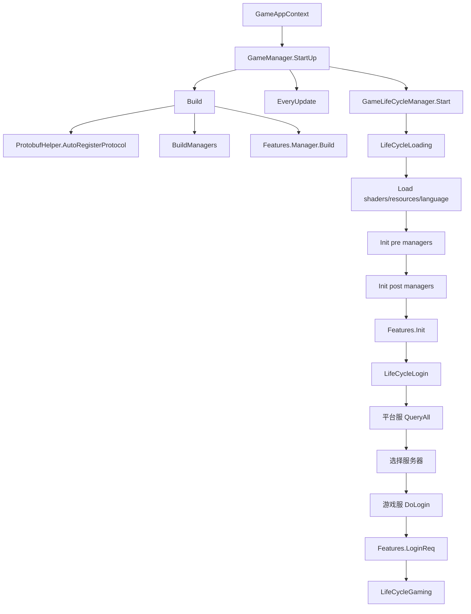

# LNV 项目启动与生命周期流程

## 1. 这篇笔记解决什么问题

这篇记录 LNV 客户端从启动到进入游戏的主链路，重点是看懂：

- 游戏入口怎么进入热更业务。
- `GameManager` 为什么是核心调度点。
- `LifeCycleLoading -> LifeCycleLogin -> LifeCycleGaming` 怎么切换。
- 配置、UI、网络、Feature 这些模块在什么时候初始化。
- 登录成功后为什么还要执行各个 Feature 的 `LoginReq`。

核心代码位置：

```text
D:\LNV\trunk\client\Hotfix\Core\GameManager.cs
D:\LNV\trunk\client\Hotfix\Core\GameAppContext.cs
D:\LNV\trunk\client\Hotfix\Core\LifeCycle\GameLifeCycleManager.cs
D:\LNV\trunk\client\Hotfix\Core\LifeCycle\LifeCycleState\LifeCycleLoading.cs
D:\LNV\trunk\client\Hotfix\Core\LifeCycle\LifeCycleState\LifeCycleLogin.cs
D:\LNV\trunk\client\Hotfix\Core\LifeCycle\LifeCycleState\LifeCycleGaming.cs
D:\LNV\trunk\client\Hotfix\Features\Manager.cs
```

## 2. 项目整体框架

LNV 是 Unity/Tuanjie 客户端项目，业务代码主要在 `Hotfix` 目录下。整体可以按这几层理解：

```text
Unity/Tuanjie 工程
-> GameAppContext / GameManager
-> Manager 层
-> LifeCycle 状态机
-> Feature 业务模块
-> UI Controller/View
-> ConfigManager / Luban 配置表
-> WebService HTTP 平台服
-> NetMessageManager Protobuf 游戏服长连接
```

主要目录：

```text
D:\LNV\trunk\client
客户端 Unity/Tuanjie 工程

D:\LNV\trunk\client\Hotfix
热更 C# 业务逻辑

D:\LNV\trunk\client\Hotfix\Core
核心 Manager、生命周期、UI、配置、资源、事件、网络平台服封装

D:\LNV\trunk\client\Hotfix\Features
业务 Feature，比如登录、玩家、活动、战斗、资源、竞技场等

D:\LNV\trunk\client\Hotfix\UI
UI Controller 和自动生成 View 绑定代码

D:\LNV\trunk\client\Hotfix\Database
Luban 配置表生成代码

D:\LNV\trunk\client\Hotfix\PBStruct
Protobuf 协议生成代码
```

## 3. 启动主链路

主链路可以简化成：

```text
GameAppContext
-> GameManager.StartUp()
-> GameManager.Build()
-> ProtobufHelper.AutoRegisterProtocol()
-> BuildManagers()
-> Features.Manager.Instance.Build()
-> 订阅 EveryUpdate()
-> GameLifeCycleManager.Start()
-> 进入 LifeCycleLoading
```

`GameManager.StartUp()` 是热更业务启动的核心方法，里面做三件事：

```text
1. Build()
2. 注册每帧 Update
3. GLifeCycleManager.Start()
```

`Build()` 里会先自动注册 Protobuf 协议，再构建所有 Manager，最后构建 Feature。

## 4. GameManager 负责什么

`GameManager` 是全局核心管理器入口。它持有项目里最常用的 Manager：

```text
GUIManager
UI 管理器

GResourceManager
资源管理器

GConfigManager
配置表管理器

GEventManager
事件管理器

GLifeCycleManager
生命周期状态机

GameMessageManager
游戏服长连接消息管理器

WebServerManager
平台服 HTTP 接口管理器

PlatformManager
平台 SDK 管理器

GRedPointManager
红点管理器

PreloadManager
预加载管理器
```

源码里 `BuildManagers()` 大概是这样：

```csharp
GResourceManager = AddManager<ResourceManager>(false);
GUIManager = AddManager<Core.UI.Manager>(false);

GConfigManager = AddManager<ConfigManager>();
GRedPointManager = AddManager<RedPointManager>();
UIEffectManager = AddManager<Core.UIEffect.Manager>();
GJumpManager = AddManager<JumpManager>();
GSoundManager = AddManager<SoundManager>();
GEventManager = AddManager<EventManager>();
GLifeCycleManager = AddManager<GameLifeCycleManager>();
PreloadManager = AddManager<PreloadManager>();
GameMessageManager = AddManager<NetMessageManager>();
PlatformManager = AddManager<PlatformManager>();
WebServerManager = AddManager<Core.WebService.Manager>();
GLanguageManager = AddManager<LanguageManager>();
```

重点是 `AddManager<T>(bool delayInit = true)`。

如果 `delayInit = false`，会进入 `preInitList`，在 Loading 早期初始化。

如果 `delayInit = true`，会进入 `postInitList`，在 Loading 后半段初始化。

## 5. Manager 初始化顺序

`LifeCycleLoading.OnEnter()` 里会做初始化，顺序大概是：

```text
显示 loading
-> LoadShaders()
-> ResourceHook.Init()
-> GLanguageManager.Load()
-> InitGameManagers(true)
-> InitGameManagers(false)
-> Features.Manager.Instance.Init()
-> 隐藏 loading
-> 切到 Login 状态
```

对应代码位置：

```text
D:\LNV\trunk\client\Hotfix\Core\LifeCycle\LifeCycleState\LifeCycleLoading.cs
```

这里的关键点是：配置表 `ConfigManager.Init()`、网络管理器、平台管理器、红点等都必须在进入 Login 之前完成初始化。

如果登录界面、活动、接口里读不到配置，先确认 Loading 初始化有没有正常走完。

## 6. 生命周期状态机

生命周期枚举在：

```text
D:\LNV\trunk\client\Hotfix\Core\LifeCycle\GameLifeCycleManager.cs
```

状态如下：

```csharp
public enum GameLifeCycleState
{
    AutoPatch,
    Loading,
    Login,
    Gaming,
}
```

当前代码中注册了三个主要状态：

```text
LifeCycleLoading
LifeCycleLogin
LifeCycleGaming
```

`GameLifeCycleManager.Start()` 默认进入 `Loading`：

```csharp
finiteStateMachince.TranslateToState(GameLifeCycleState.Loading);
```

完整状态流：

```text
Loading
-> Login
-> Gaming
```

退出登录或者重登时，会从 `Gaming` 回到 `Login`。

## 7. Loading 阶段链路

Loading 阶段主要做资源和业务初始化：

```text
LifeCycleLoading.Enter()
-> GameManager.PlatformManager.SDKReport(EvtStartLoading)
-> 显示 loading
-> PreloadManager.LoadShaders()
-> ResourceHook.Init()
-> LanguageManager.Load()
-> GameManager.InitGameManagers(true)
-> GameManager.InitGameManagers(false)
-> Features.Manager.Instance.Init()
-> 隐藏 loading
-> Machine.TranslateToState(Login)
```

这个阶段的难点：

- 初始化是异步的，顺序错了会导致后面的系统拿不到 Manager。
- 配置表必须在业务读取之前加载完。
- Feature 的 `Init()` 只负责初始化自身数据、注册协议、绑定事件，不应该做重型 UI 展示逻辑。
- 如果 Loading 卡住，要看每个 Manager 的 `Init()` 有没有异常或 await 不返回。

## 8. Login 阶段链路

`LifeCycleLogin` 是登录总流程。核心流程：

```text
VerifyPackage()
-> PlatformManager.Login()
-> VerifyLoginToken()
-> WebServerManager.QueryAll()
-> 显示公告/开服时间
-> GUIManager.Wait<Login>() 选择服务器
-> Features.Login.DoLogin(serverInfo)
-> BattleManager.Ready()
-> Features.Manager.Instance.LoginReq()
-> BattleManager.AfterLoginReq()
-> TranslateToState(Gaming)
```

关键代码位置：

```text
D:\LNV\trunk\client\Hotfix\Core\LifeCycle\LifeCycleState\LifeCycleLogin.cs
D:\LNV\trunk\client\Hotfix\Features\Login.cs
```

其中 `WebServerManager.QueryAll()` 是 HTTP 平台服接口，拿到服务器信息：

```text
uid
sign
timestamp
sid
server_url
server_port
ws_url
server_status
```

`Features.Login.DoLogin(serverInfo)` 是游戏服长连接登录：

```text
SetServerAddress()
-> Connect()
-> ServerTime.Sync()
-> RequestLogin()
-> CallRequest<LoginResponse>(LoginRequest, false)
```

如果 `LoginResponse.Status == 0`，代表需要创角，会进入创建角色流程。

如果登录成功，才会继续执行所有 Feature 的 `LoginReq()`。

## 9. Feature 初始化和登录请求

Feature 体系入口：

```text
D:\LNV\trunk\client\Hotfix\Features\Manager.cs
D:\LNV\trunk\client\Hotfix\Core\Feature.cs
```

Feature 类通过 `[Feature]` 标记被自动扫描出来。

`Features.Manager.Instance.Build()` 会做：

```text
扫描所有带 FeatureAttribute 的类型
-> 根据 Sort 排序
-> Activator.CreateInstance 创建实例
-> 放入 featureList
```

Feature 生命周期：

```text
Build()
-> Init()
-> LoginReq()
-> Update()
-> Clear()
```

`Init()` 常用于：

```text
初始化本地字段
注册服务端主动推送协议
绑定游戏事件
```

`LoginReq()` 常用于：

```text
登录后请求业务初始数据
例如活动数据、竞技场数据、玩家资源、红点数据
```

`Feature.RegisterProtocol<T>()` 底层会调用：

```text
NetMessageManager.Register(action)
```

所以 Feature 退出或者回登录时，要通过 `Recycle()` 统一注销协议，避免重复注册。

## 10. 进入 Gaming 阶段

登录成功后，不是立刻进主界面，而是先执行：

```text
Features.Manager.Instance.LoginReq(token)
-> BattleManager.AfterLoginReq()
-> Machine.TranslateToState(GameLifeCycleState.Gaming, isCreate)
```

这样设计的原因是：

- 玩家基础数据要先拉到。
- 活动、红点、战斗未完成状态要先同步。
- UI 打开后直接能显示正确数据。
- 创角和非创角进入游戏的逻辑可以区分。

如果主界面数据为空，不能只查 UI，要先查对应 Feature 的 `LoginReq()` 是否执行、接口是否返回、Module/Data 是否更新。

## 11. 链路图



## 12. 排查启动问题的方法

启动卡住时，优先按这个顺序查：

```text
1. GameManager.StartUp 有没有执行
2. BuildManagers 有没有创建对应 Manager
3. LifeCycleLoading 有没有进入
4. InitGameManagers(true/false) 卡在哪个 Manager
5. ConfigManager.DB 是否为空
6. Features.Manager.Instance.Init 有没有执行
7. LifeCycleLogin.StartLogin 有没有执行
8. QueryAll 是否返回 serverInfo
9. DoLogin 是否连接成功
10. Features.LoginReq 是否卡住
```

典型日志关键字：

```text
LifeCycleLoading OnEnter
All Pre Manager has Initialized
All Post Manager has Initialized
LifeCycleLogin|VerifyPackage
LifeCycleLogin|QueryAll
LifeCycleLogin|LoginPlatform
LifeCycleLogin|VERIFY
Feature Start LoginReq
Feature Finish LoginReq
```

## 13. 难点总结

这个项目启动链路的难点不是代码入口难找，而是异步链太长：

- Loading 里初始化 Manager。
- Login 里有平台 SDK、HTTP 平台服、游戏服长连接。
- 登录成功后还有每个 Feature 自己的 `LoginReq()`。
- 一个地方失败，表面上可能表现为 UI 空、按钮没反应、红点不显示、活动没入口。

排查时不要只看最后报错的位置，要沿着链路往上查数据从哪里来。

## 14. 大白话总结

这个项目启动可以理解成：

```text
先把工具箱准备好
-> 再加载配置和资源
-> 再进入登录
-> 登录先问平台服我该进哪个服务器
-> 再连真正的游戏服
-> 游戏服登录成功后，把各个业务模块的数据都拉一遍
-> 最后进游戏主界面
```

`GameManager` 就像总开关，负责把所有 Manager 建起来。

`LifeCycle` 就像流程导演，规定现在是加载、登录还是游戏中。

`Feature` 就是每个业务系统，比如活动、战斗、玩家数据。

以后遇到“进不去游戏”“数据为空”“活动没出来”，不要直接猜 UI 问题，先按启动链路查：`Loading 初始化 -> Login 平台服 -> 游戏服登录 -> Feature.LoginReq -> UI 展示`。
