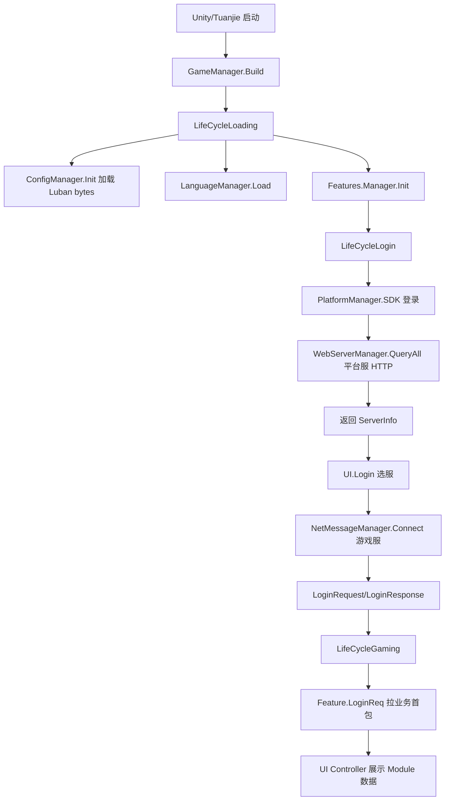

# LNV 项目接前后端接口与框架总结

本文档总结 LNV 项目当前客户端框架、配置表读取链路、前后端接口接入方式、活动模块接入步骤，以及本阶段已定位/处理过的问题。

基于代码位置：

```text
D:\LNV
├── trunk/client                         Unity/Tuanjie 客户端工程
├── trunk/client/Hotfix                  热更 C# 业务逻辑
├── trunk/client/Hotfix/PBStruct         Protobuf 生成代码
├── trunk/client/Hotfix/Database         Luban 配置表生成代码
├── trunk/client/Assets/DynamicRes       动态资源、UI、配置 bytes
├── trunk/server_bin/config/src          服务端/导表源配置 CSV
└── server                               服务端目录
```

## 1. 项目整体框架

这个项目是 Unity/Tuanjie 游戏客户端，核心业务主要在 `Hotfix` 目录中。

主要分层如下：

```text
Unity/Tuanjie 工程
-> GameAppContext / GameManager 启动
-> LifeCycle 状态机
-> Core Managers
-> Features 业务模块
-> UI Controllers
-> ConfigManager / DB.Manager 读配置
-> WebService HTTP 接平台服
-> NetMessageManager 接游戏服长连接
```

### 1.1 启动主链路

入口核心在：

```text
trunk/client/Hotfix/Core/GameManager.cs
trunk/client/Hotfix/Core/LifeCycle/LifeCycleState/LifeCycleLoading.cs
trunk/client/Hotfix/Core/LifeCycle/LifeCycleState/LifeCycleLogin.cs
```

启动流程：

```text
GameAppContext.Startup
-> GameManager.StartUp()
-> GameManager.Build()
-> GLifeCycleManager.Start()
-> LifeCycleLoading
-> InitGameManagers(true)
-> InitGameManagers(false)
-> Features.Manager.Instance.Init()
-> LifeCycleLogin
-> LifeCycleGaming
```

`GameManager.Build()` 会注册核心 Manager：

```csharp
GConfigManager = AddManager<ConfigManager>();
GUIManager = AddManager<Core.UI.Manager>(false);
GameMessageManager = AddManager<NetMessageManager>();
WebServerManager = AddManager<Core.WebService.Manager>();
GLanguageManager = AddManager<LanguageManager>();
```

其中：

```text
ConfigManager        负责配置表加载
GUIManager           负责 UI 打开、关闭、弹窗、Toast
NetMessageManager    负责游戏服长连接 Protobuf 通信
WebServerManager     负责平台服 HTTP 通信
LanguageManager      负责当前语言环境
Feature.Manager      负责业务模块初始化
```

## 2. 配置表读取链路

配置表不是运行时直接读 CSV，而是先由 Luban 生成 `.bytes`，客户端运行时读取 bytes 并反序列化成内存对象。

### 2.1 配置表产物位置

客户端运行时配置产物在：

```text
trunk/client/Assets/DynamicRes/Tables/Luban
```

例如：

```text
tables_item.bytes
tables_language.bytes
tables_hero.bytes
```

源配置可在这里看到：

```text
trunk/server_bin/config/src
```

### 2.2 读表入口

入口文件：

```text
trunk/client/Hotfix/Core/Config/ConfigManager.cs
```

核心代码：

```csharp
public async Task Init()
{
    var assets = await LoadText();
    assetByteBufs = new Dictionary<string, ByteBuf>();

    foreach (var kv in assets)
    {
        assetByteBufs.Add(kv.Key, new ByteBuf(kv.Value));
    }

    DB = new DB.Manager(LoadByteBufForLuban);
}
```

运行时加载逻辑：

```text
ConfigManager.Init()
-> LoadText()
-> ResourceMgr.GetResAssetBundle("cfg")
-> ab.LoadAllAssets<TextAsset>()
-> TextAsset.bytes
-> new ByteBuf(bytes)
-> new DB.Manager(loader)
```

如果没有拿到 `cfg` AssetBundle，会走 Addressables：

```csharp
var temp = await Addressables.LoadResourceLocationsAsync("cfg").Task;
var handle = Addressables.LoadAssetsAsync<TextAsset>(
    temp,
    _ => { listCfg.Add(_.name, _.bytes); });
```

### 2.3 DB.Manager 初始化所有表

文件：

```text
trunk/client/Hotfix/Database/AutoGen/Luban/Manager.cs
```

示例：

```csharp
Language = new Tables.Language(loader("tables_language"));
tables.Add("Tables.Language", Language);

item = new Tables.item(loader("tables_item"));
tables.Add("Tables.item", item);

hero = new Tables.hero(loader("tables_hero"));
tables.Add("Tables.hero", hero);
```

`loader("tables_item")` 会回到 `ConfigManager.LoadByteBufForLuban`：

```csharp
private ByteBuf LoadByteBufForLuban(string name)
{
    return LoadByteBuf(name, true);
}
```

`remove = true` 表示 bytes 被表对象消费后会从临时字典里移除，最终常驻内存的是解析后的表对象和索引字典。

### 2.4 Tables 与 Beans 的职责

以 `hero` 表为例：

```text
trunk/client/Hotfix/Database/AutoGen/Luban/Tables/hero.cs
trunk/client/Hotfix/Database/AutoGen/Luban/Beans/hero.cs
```

职责区别：

```text
Tables/hero.cs = 整张 hero 表，负责加载、缓存、建索引、查询
Beans/hero.cs  = hero 表里的一行，代表一个英雄配置
```

`Tables/hero.cs` 核心代码：

```csharp
for(int n = _buf.ReadSize(); n > 0; --n)
{
    Beans.hero _v;
    _v = Beans.hero.Deserializehero(_buf);
    _dataList.Add(_v);
}

_dataMap_idx = new Dictionary<int, Beans.hero>();

foreach(var _v in _dataList)
{
    _dataMap_idx.Add(_v.Idx, _v);
}
```

对外查询：

```csharp
public List<Beans.hero> DataList => _dataList;

public Beans.hero GetByIdx(int key) =>
    _dataMap_idx.TryGetValue(key, out Beans.hero __v) ? __v : null;
```

`Beans/hero.cs` 负责按字段顺序读一行：

```csharp
Idx = _buf.ReadInt();
Type = _buf.ReadInt();
Occupation = _buf.ReadInt();
Element = _buf.ReadInt();
Star = _buf.ReadInt();
HeroName = _buf.ReadString();
Skill = Beans.mapii.Deserializemapii(_buf);
```

### 2.5 手写扩展表逻辑

自动生成代码不要手改。

如果需要额外索引或辅助方法，项目使用：

```text
trunk/client/Hotfix/Database/LubanMaual
```

例如：

```text
trunk/client/Hotfix/Database/LubanMaual/hero.cs
```

它扩展了 `hero` 表：

```csharp
public Beans.hero GetByType(int type) =>
    _dataMapType.TryGetValue(type, out var list) ? list : null;

public Boolean ContainsKeyByType(int type) =>
    _dataMapType.TryGetValue(type, out var list) ? true : false;

public List<Beans.hero> GetByKind(int kind) =>
    _dataMapKind.TryGetValue(kind, out var list) ? list : null;
```

所以业务里经常这样读：

```csharp
var heroCfg = ConfigManager.DB.hero.GetByType(heroType);
var nameLang = heroCfg.HeroName;
var element = heroCfg.Element;
var occupation = heroCfg.Occupation;
```

### 2.6 业务层读配置常见写法

道具表：

```csharp
var itemCfg = ConfigManager.DB.item.GetByIdx(itemId);
var icon = itemCfg.Icon;
var rare = itemCfg.Rare;
```

英雄表：

```csharp
var heroCfg = ConfigManager.DB.hero.GetByType(heroId);
var heroName = LanguageHelper.GetLanguage(heroCfg.HeroName);
```

语言表：

```csharp
var formula = ConfigManager.DB.Language.GetByLangId(langId);
return formula.Lang;
```

列表遍历：

```csharp
foreach (var cfg in ConfigManager.DB.hero.DataList)
{
    // filter / sort / build UI data
}
```

## 3. 前后端接口总体链路

项目里前后端通信主要分两类。

```text
1. 平台服 HTTP
   用于 SDK 登录后查用户、区服、公告、渠道配置、包体合法性等

2. 游戏服长连接 Protobuf
   用于进入游戏后的业务请求、活动请求、战斗、背包、英雄、任务等
```

## 4. 平台服 HTTP 链路

核心文件：

```text
trunk/client/Hotfix/Core/WebService/Manager.cs
```

### 4.1 HTTP 接口常量

`WebService.Manager` 里定义了平台接口路径：

```csharp
private const string RECOMMEND_SERVER_URI = "Platform/serverNew?";
private const string SERVER_AREA_URI = "Platform/serverAll?";
private const string SERVER_PAGE_URI = "Platform/serverPage?";
private const string LOGIN_SERVER_URI = "Platform/login?";
private const string SERVER_HISTORY_URI = "Platform/serverRole?";
private const string SERVER_INIT_URI = "Platform/getUserServer?";
private const string NOTICE_URI = "Platform/notice?";
private const string PUSH_ROLE_URI = "Platform/recordRole?";
private const string VERIFY_TOKEN = "Platform/getOpenId?";
private const string QUERY_CHANNEL_CONFIG = "Platform/getChannelConfig?";
private const string VERIFY_PACKAGE = "Platform/checkPackageLogin?";
```

平台根地址来自：

```csharp
AotParam.ins.platform_url
```

### 4.2 SDK 登录到平台服查询

登录状态机：

```text
LifeCycleLogin
-> PlatformManager.Login()
-> PlatformBase/Android/iOS/Editor Login()
-> PlatformManager.OnLogin()
-> WebServerManager.QueryAll()
```

`QueryAll()` 的作用：

```text
1. 用 SDK uid/token/channel 信息请求平台服
2. 返回平台 UID、sign、timestamp
3. 返回默认服务器 ServerInfo
4. 查询角色历史服务器
5. 查询渠道配置
```

关键代码：

```csharp
var url = $"{AotParam.ins.platform_url}{SERVER_INIT_URI}";
var body = StringHelper.PackageBodyParams(new AccountInfoRequest()
{
    open_id = platform.Uid,
    c_id = platform.Cid,
    c_son_id = platform.CSonId,
    channel = platform.ChannelName,
    device_type = platform.DeviceType,
    uuid = platform.OPenId,
    package_version = GameAppContext.PackageVersion,
    access_token = platform.Token,
    channel_data = platform.Token,
    country = platform.GetCountryName(),
    language = platform.GetLanguage(),
});

var resultJson = await WebRequest(url, body);
var initServerInfo = JsonHelper.ToObject<AccountInfoResponse>(resultJson);
```

返回后构造 `ServerInfo`：

```csharp
var selectedServerInfo = new ServerInfo()
{
    sid = initServerInfo.data.sid,
    s_p = initServerInfo.data.server_port,
    ws_url = initServerInfo.data.ws_url,
    s_u = initServerInfo.data.server_url,
    s_s = initServerInfo.data.server_status,
};
```

这些字段会给游戏服长连接使用。

### 4.3 HTTP 请求封装

底层封装：

```csharp
private async Task<string> WebRequest(string url, string body = "", bool encrypt = true)
```

内部使用：

```csharp
UnityWebRequest.Get(url)
UnityWebRequest.Post(url, formatData)
```

响应解析：

```csharp
JsonHelper.ToObject<T>(resultJson)
```

注意点：

```text
1. 平台接口返回 JSON
2. body 通常通过 StringHelper.PackageBodyParams 打包
3. 默认 encrypt = true，会按项目现有加解密格式处理
4. 平台服接口失败通常影响登录、选服、公告、渠道配置
```

## 5. 游戏服长连接 Protobuf 链路

核心文件：

```text
trunk/client/Hotfix/Managers/Network/NetMessageManager.cs
trunk/client/Hotfix/Utils/ProtobufHelper.cs
trunk/client/Hotfix/PBStruct
```

### 5.1 连接游戏服

登录游戏服在：

```text
trunk/client/Hotfix/Features/Login.cs
```

关键代码：

```csharp
GameManager.GameMessageManager.SetServerAddress(server.s_u, server.s_p, server.ws_url);
GameManager.GameMessageManager.Connect(OnGameSessionError);
```

连接地址来自平台服返回的 `ServerInfo`：

```text
s_u     server_url
s_p     server_port
ws_url  WebGL / MiniGame 场景使用的 websocket 地址
```

`NetMessageManager.Connect()`：

```csharp
#if UNITY_WEBGL
Session = GameNetworkComponent.Create(_wsUrl, sessionErrorCallback, connectCallback);
#else
Session = GameNetworkComponent.Create(_host, _port, sessionErrorCallback, connectCallback);
#endif

Session.Start();
```

### 5.2 Protobuf 协议注册

启动时会自动注册 Protobuf opcode：

```text
GameManager.Build()
-> Utils.ProtobufHelper.AutoRegisterProtocol()
```

代码：

```csharp
public static void AutoRegisterProtocol()
{
    var list = AttributeHelper.GetHotfixTypesByAttribute<PBStruct.MessageAttribute>();
    for (int i = 0; i < count; ++i)
    {
        var type = list[i].Item1;
        var attribute = list[i].Item2 as PBStruct.MessageAttribute;
        RegisterProtocol(attribute.Opcode, type);
    }
}
```

PBStruct 生成类上有类似：

```csharp
[Message((int)LoginResponse.Types.Proto.Id)]
public sealed class LoginResponse : pb::IMessage
```

因此接新协议时，要确保 Protobuf 生成代码带 `MessageAttribute`，否则 `GetProtoId<T>()` 会拿不到 opcode。

### 5.3 请求调用方式

业务请求一般这样写：

```csharp
var response = await GameManager.GameMessageManager.CallRequest<SomeResponse>(
    new SomeRequest
    {
        Idx = idx,
    });
```

重要细节：

```csharp
public async Task<T> CallRequest<T>(IMessage request, bool isRPC = true) where T : IMessage
{
    var protoId = ProtobufHelper.GetProtoId<T>();
    var wrapper = await SessionCall(protoId, request, isRPC);
    ...
    var response = ParseMessageFrom<T>(wrapper.Data);
    return response;
}
```

这个项目当前写法是：`CallRequest<T>()` 用 **Response 类型 T** 获取 protoId。

因此接接口时要注意：

```text
CallRequest<XXXResponse>(new XXXRequest())
```

不要写反，也不要只看 Request 的 opcode。

### 5.4 MessageWrapper 包装

请求会被包装成 `MessageWrapper`：

```csharp
var rpcId = isRPC ? ++NetMessage.Session.RpcId : 0;
var wrap = new MessageWrapper
{
    ProtoId = protoId,
    Data = ByteString.CopyFrom(request.ToByteArray()),
    SerialNumber = rpcId,
};

Session.Send(wrap);
```

字段含义：

```text
ProtoId         当前请求/响应对应的协议号
Data            request 序列化后的 Protobuf bytes
SerialNumber    RPC 流水号，用于匹配响应
```

### 5.5 响应分发

服务端返回后进入：

```csharp
private void MessageDispatch(NetMessage.Session session, int protoId, Stream bytes)
```

分发逻辑：

```text
1. 解析 MessageWrapper
2. 如果 SerialNumber != 0，按 rpcId 找回调
3. 如果 SerialNumber == 0，按 protoId 找非 RPC 回调
4. 如果找不到回调，当作服务端推送消息
5. 推送消息走 MessageHandler(protoId, data)
```

推送消息注册：

```csharp
RegisterProtocol<SomePushMessage>(OnSomePushMessage);
```

`Core.Feature` 对注册做了封装：

```csharp
protected void RegisterProtocol<T>(Action<T> action) where T : IMessage
{
    registerProtocols.Add(typeof(T));
    NetMessageManager.Register(action);
}
```

Feature 回收时会自动反注册。

## 6. 登录接口完整链路

登录链路分平台服和游戏服两段。

```text
LifeCycleLogin.Enter
-> PlatformManager.Login
-> SDK / Editor 登录
-> PlatformManager.OnLogin
-> WebServerManager.QueryAll
-> 返回 ServerInfo
-> UI.Login 选服
-> Features.Login.DoLogin
-> NetMessageManager.Connect
-> LoginRequest / LoginResponse
-> 进入 LifeCycleGaming
```

关键步骤：

```text
1. 平台登录拿 uid/token
2. 平台服 QueryAll 拿 uid/sign/server_url/server_port/ws_url
3. 选服 UI 返回 ServerInfo
4. 连接游戏服
5. 发送 LoginRequest
6. 返回 LoginResponse
7. 如果角色不存在，走 CreateRoleRequest
8. 登录成功后各 Feature 发 LoginReq 拉首包数据
```

游戏服登录请求位置：

```text
trunk/client/Hotfix/Features/Login.cs
```

示例：

```csharp
var response = await GameManager.GameMessageManager.CallRequest<LoginResponse>(
    new LoginRequest
    {
        Uid = webService.Uid,
        Sign = webService.Sign,
        Time = webService.TimeStamp,
    });
```

## 7. 业务接口接入详细步骤

以下是接一个新业务接口的推荐流程。

### 7.1 确认接口类型

先判断接口属于哪一类：

```text
平台/渠道/公告/选服/包验证 -> WebService HTTP
玩法/活动/背包/英雄/战斗 -> NetMessageManager Protobuf
```

### 7.2 后端定义协议

如果是游戏服接口，需要后端提供：

```text
XXXRequest
XXXResponse
字段定义
Opcode / Proto Id
错误码或 TipsMessage 返回规则
是否需要服务端推送 XXXMessage
```

客户端需要同步生成：

```text
trunk/client/Hotfix/PBStruct/*.cs
```

生成后确认类上有：

```csharp
[Message((int)XXXResponse.Types.Proto.Id)]
```

### 7.3 写 Service 请求接口

不要直接在 UI 里到处写网络请求。常见做法是放到 Feature 或 Activity Service。

普通 Feature 示例：

```csharp
public async Task RequestSomeData()
{
    var response = await GameManager.GameMessageManager.CallRequest<SomeResponse>(
        new SomeRequest
        {
            Id = id,
        });

    if (response == null)
    {
        return;
    }

    // 更新模块数据
}
```

活动 Service 示例：

```csharp
protected override async Task<bool> QueryData()
{
    var response = await GameManager.GameMessageManager.CallRequest<ActivityInfoResponse>(
        new ActivityInfoRequest());

    if (response == null)
    {
        owner.UpdateDutyTime(0, 0, 0);
        return false;
    }

    realModule.UpdateData(response);
    owner.UpdateDutyTime(0, response.EndTime, response.EndTime);
    return true;
}
```

领取奖励接口：

```csharp
public async Task RequestReward(int idx)
{
    var response = await GameManager.GameMessageManager.CallRequest<ActivityRewardResponse>(
        new ActivityRewardRequest
        {
            Idx = idx,
        });

    if (response == null)
    {
        return;
    }

    realModule.UpdateReward(response);
    Manager.Instance.Get<RoleResource>().OnReward(response.Changing, true);
    UpdateModuleAndRefresh();
}
```

### 7.4 写 Module 存状态

Module 负责保存服务端数据和配置表计算结果，不直接处理 UI。

示例：

```csharp
public class P695 : Module
{
    public List<int> LoginRewards = new List<int>();
    public int LoginDays;

    public bool IsReward(int day)
    {
        return LoginRewards.FindIndex(o => o == day) >= 0;
    }

    public State GetState(int day)
    {
        if (day > LoginDays) return State.Lock;
        if (IsReward(day)) return State.Finish;
        return State.Archive;
    }

    public Cost GetReward(int day)
    {
        var costs = ConfigManager.DB.laowanjiadenglu.GetByIdx(day);
        return costs != null && costs.RewardsC.Count > 0 ? costs.RewardsC[0] : new Cost();
    }
}
```

### 7.5 UI Controller 只做展示和点击

UI 层获取 promotion：

```csharp
promotion = Manager.Instance.Get<Activity>().GetPromotion(EPromotion.ID695);
module = promotion.Module as Module;
service = promotion.Service as Service;
```

刷新 UI：

```csharp
var state = module.GetState(day);
var reward = module.GetReward(day);
itemIcon.SetItemData(reward);
```

点击按钮：

```csharp
service.RequestReward(data.Index);
```

### 7.6 推送消息接入

如果后端有主动推送：

```csharp
public override void Init()
{
    RegisterProtocol<SomeMessage>(OnSomeMessage);
}

private void OnSomeMessage(SomeMessage msg)
{
    module.UpdateData(msg);
    GameManager.GEventManager.Fire(...);
}
```

不要忘记：

```text
Feature.Recycle() 会自动 UnRegisterAllProtocols()
```

如果绕过 `Feature.RegisterProtocol` 直接用 `NetMessageManager.Register`，需要自己考虑反注册。

## 8. 活动模块接入链路

活动常见目录：

```text
trunk/client/Hotfix/Features/Activities/Services
trunk/client/Hotfix/Features/Activities/Modules
trunk/client/Hotfix/UI/Controllers/Activities
trunk/client/Hotfix/UI/Controllers/ResidentActivities
```

一个活动一般包含：

```text
Service     负责请求后端、更新模块
Module      负责保存状态、配置计算、红点
UI          负责展示、交互、按钮回调
Config      Luban 表，负责静态奖励、文案、规则
PBStruct    后端动态数据结构
```

典型链路：

```text
Activity.Init
-> Promotion 扫描 [Promotion(...)] Attribute
-> 创建 Service + Module
-> Service.QueryData 拉服务端数据
-> Module 保存状态
-> UI 打开时拿 promotion.Module / promotion.Service
-> UI 展示 Module 数据
-> 用户点击
-> Service 发 Request
-> Response 更新 Module
-> UpdateModuleAndRefresh 刷 UI / 红点 / 资源
```

示例 Attribute：

```csharp
[Promotion(EPromotion.ID695, typeof(Modules.Fixtures.P695), EObserverFlags.CHANGE_DAY)]
public class P695 : Service
{
}
```

## 9. UI 框架链路

UI 代码分自动生成和手写两部分。

```text
Hotfix/UI/AutoGen/Views       自动绑定 prefab 节点
Hotfix/UI/AutoGen/Controllers 自动生成基础 Controller
Hotfix/UI/Controllers         手写业务逻辑
Assets/DynamicRes/Prefabs/UI  UI prefab 资源
```

例子：

```text
AutoGen/Views/Login.cs
-> tipSymbolText = refList["SafeArea/bottom/tip.SymbolText"] as WXB.SymbolText;

Controllers/Login.cs
-> View.tipSymbolText.text = text;
```

规则：

```text
1. AutoGen 文件不要手改，会被工具覆盖
2. 手写逻辑放 Hotfix/UI/Controllers
3. prefab 组件引用靠 CompRefScriptable 路径绑定
4. UI 打开一般通过 GameManager.GUIManager.Open / Wait
```

## 10. 本阶段已处理/定位的问题

### 10.1 登录页备案号定位

主位置：

```text
trunk/client/Hotfix/UI/Controllers/Login.cs
```

显示链路：

```text
Login.prefab
-> SafeArea/bottom/tip.SymbolText
-> AutoGen/Views/Login.cs: tipSymbolText
-> Controllers/Login.cs 写入备案/出版信息
```

结论：

```text
登录底部备案号不是配置表主链路读出来的，而是 Login.cs 里按渠道硬编码赋值。
```

建议：

```text
国内正式包不要直接删除备案/出版信息。
审核包、海外包、内部测试包可以按条件隐藏。
```

推荐写法：

```csharp
if (ShouldHideLegalInfo())
{
    View.tipSymbolText.text = "";
}
else
{
    // 原备案/出版信息逻辑
}
```

### 10.2 MaskableParticle 缺 CanvasRenderer

报错现象：

```text
MissingComponentException:
There is no 'CanvasRenderer' attached to the "itemGuangyun" game object,
but a script is trying to access it.
```

定位位置：

```text
trunk/client/Hotfix/UI/Controllers/Activities/P650HalfMonth/P650HalfMonth2.cs
trunk/client/Hotfix/Utils/MaskableParticle.cs
```

原因：

```text
P650HalfMonth2 给 itemGuangyun / itemlz 动态挂 MaskableParticle。
MaskableParticle 继承 MaskableGraphic。
MaskableGraphic 属于 UI Graphic，必须依赖 CanvasRenderer。
原组件只声明了 ParticleSystem，没有声明 CanvasRenderer。
```

根因修复：

```csharp
[RequireComponent(typeof(ParticleSystem), typeof(ParticleSystemRenderer), typeof(CanvasRenderer))]
public class MaskableParticle : MaskableGraphic
```

原则：

```text
不要在 Awake 里运行时兜底 AddComponent。
应该在组件依赖声明上解决，避免掩盖 prefab/组件设计问题。
```

### 10.3 Tuanjie MiniGame Support

现象：

```text
Tuanjie 1.8.0 MiniGame Support Setup 需要单独安装。
Build Settings 里切到 MiniGame 后会触发平台资源重导入。
```

理解：

```text
MiniGame Support 是团结/Tuanjie 的构建目标扩展。
它不是普通业务代码，也不是自动跟随项目存在。
安装后当前编辑器才具备 MiniGame 平台构建能力。
```

注意：

```text
不小心点 Switch Platform 后，不要强杀 Unity。
等 Import 完成。
如果只是误切，完成后再切回原平台。
Switch Platform 会触发资源导入、平台宏变化、缓存重建，可能耗时较长。
```

## 11. 接接口时最容易踩的点

### 11.1 CallRequest 的泛型是 Response

项目当前写法：

```csharp
CallRequest<XXXResponse>(new XXXRequest())
```

不要写成：

```csharp
CallRequest<XXXRequest>(...)
```

因为 `NetMessageManager` 内部用 `T` 取 protoId：

```csharp
var protoId = ProtobufHelper.GetProtoId<T>();
```

### 11.2 AutoGen 不要手改

这些目录通常不要直接改：

```text
Hotfix/Database/AutoGen
Hotfix/UI/AutoGen
Hotfix/PBStruct
```

正确方式：

```text
配置表改源表，然后重新导 Luban。
协议改 proto，然后重新生成 PBStruct。
UI 绑定改 prefab，然后重新生成 AutoGen。
手写扩展写到 Controllers / LubanMaual / Feature / Service / Module。
```

### 11.3 UI 不要直接吞业务状态

推荐分工：

```text
Service  请求接口
Module   保存状态和计算红点
UI       展示和按钮事件
Config   静态配置
PBStruct 服务端动态数据
```

不要把所有请求、状态、红点、配置计算都堆在 UI Controller 里。

### 11.4 接口返回空要处理

所有接口都要考虑：

```csharp
if (response == null)
{
    return;
}
```

原因：

```text
网络超时会导致 null。
服务端业务错误可能返回 TipsMessage。
NetMessageManager 收到 TipsMessage 时会走 MessageHandler，然后返回 default(T)。
```

### 11.5 配置表字段改动必须同步 bytes 和代码

如果只改 CSV，不重新导表/生成 bytes，客户端读不到新字段。

如果只改生成代码，不改 bytes 字段顺序，会读错数据。

正确链路：

```text
改源表
-> Luban 导表
-> 生成 Database/AutoGen
-> 生成 DynamicRes/Tables/Luban/*.bytes
-> Unity 重新导入资源
-> 打包/热更
```

## 12. 新接口接入模板

### 12.1 后端确认项

```text
1. Request 名称
2. Response 名称
3. ProtoId / Opcode
4. 字段类型和默认值
5. 是否 RPC
6. 是否有推送 Message
7. 错误时返回 TipsMessage 还是业务错误码
8. 是否需要配置表配合
9. 是否影响红点、资源、任务进度
```

### 12.2 客户端实现顺序

```text
1. 更新 PBStruct 生成代码
2. 确认 MessageAttribute 存在
3. 确认 ProtobufHelper.AutoRegisterProtocol 能扫描到
4. 在 Feature/Service 写请求方法
5. 在 Module 增加数据字段和状态计算
6. UI Controller 从 Module 读数据
7. UI 点击调用 Service
8. Response 后更新 Module
9. 发事件或 UpdateModuleAndRefresh 刷 UI
10. 测试断网、超时、服务端错误、重复点击、红点刷新
```

### 12.3 代码模板

Service：

```csharp
public async Task RequestXXX(int idx)
{
    var response = await GameManager.GameMessageManager.CallRequest<XXXResponse>(
        new XXXRequest
        {
            Idx = idx,
        });

    if (response == null)
    {
        return;
    }

    realModule.UpdateXXX(response);

    if (response.Changing != null)
    {
        Manager.Instance.Get<RoleResource>().OnReward(response.Changing, true);
    }

    UpdateModuleAndRefresh();
}
```

Module：

```csharp
public class XXXModule : Module
{
    public List<int> Received = new List<int>();

    public void UpdateXXX(XXXResponse response)
    {
        Received.Clear();
        Received.AddRange(response.ReceiveIds);
    }

    protected override void CalcArchived()
    {
        Archived = CheckRedDot();
    }
}
```

UI：

```csharp
private Promotion promotion;
private XXXModule module;
private XXXService service;

protected override void Create()
{
    base.Create();
    promotion = Manager.Instance.Get<Activity>().GetPromotion(EPromotion.IDXXX);
    module = promotion.Module as XXXModule;
    service = promotion.Service as XXXService;
}

private void OnClickReward(int idx)
{
    service.RequestXXX(idx);
}
```

## 13. 项目框架简图



## 14. 总结

LNV 客户端的核心思路是：

```text
配置数据走 Luban bytes。
平台信息走 WebService HTTP。
游戏业务走 NetMessageManager + Protobuf。
业务状态放 Feature/Module。
UI 只负责展示和交互。
自动生成代码不要手改。
```

接前后端接口时，最关键是把链路放对：

```text
HTTP 平台接口：
WebService.Manager -> UnityWebRequest -> JSON -> ServerInfo/ChannelConfig

游戏服接口：
PBStruct -> ProtobufHelper -> NetMessageManager.CallRequest -> Service -> Module -> UI

配置表接口：
CSV/源表 -> Luban -> bytes -> DB.Manager -> Tables/Beans -> ConfigManager.DB.xxx
```

如果后续继续做新活动或新功能，优先按 `Service + Module + UI + Config + PBStruct` 这套结构接入，后期维护成本最低。
