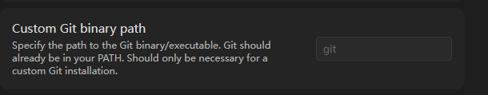
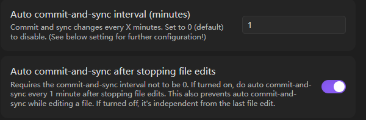
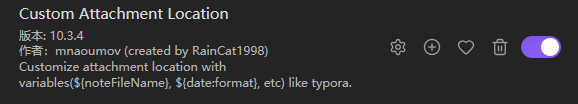
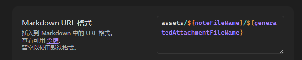
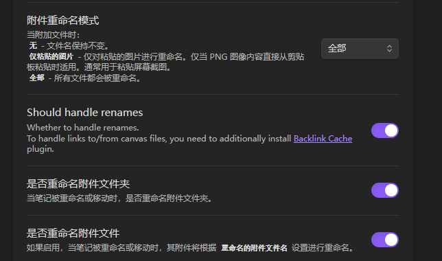

OB下载链接：
https://obsidian.md/download  下载
https://obsidian.md 官网

2 设置中 关闭安全模式 插件中下载git
然后找到电脑的git 目录，放置

把目录放到Custom git binary path后  打开新搭建好的本地git目录

然后再设置

再往下拉把pull 自动拉取即可配置我完，git 这样笔记就可以自动上传到github中

2 配置截图的格式

搜索
然后按如下图去配置即可：

assets/${noteFileName}/${generatedAttachmentFileName}

